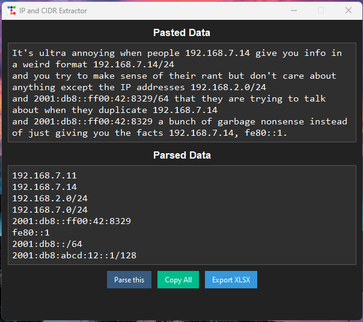

# IP Parser

- **Extracts IPv4, IPv6, and CIDR blocks** – Detects standalone IPs and network ranges for both IPv4 and IPv6.  
- **Captures link-local IPv6 addresses (`fe80::/10`)** – Ensures addresses like `fe80::1` are properly extracted.  
- **Removes trailing punctuation** – Strips unnecessary periods (`.`) that may interfere with IP detection.  
- **Sorts and deduplicates extracted addresses** – Organizes IPv4 first, followed by IPv6, maintaining correct numerical order.  
- **Provides a modern Tkinter GUI** – Built with `ttkbootstrap` using the "darkly" theme for a sleek interface.  
- **Supports direct text input and parsing** – Users can paste mixed content, and the tool extracts only valid IPs.  
- **Copy extracted IPs to clipboard** – One-click functionality to copy all parsed results for easy use.  
- **Export parsed IPs to an Excel file** – Saves extracted data in `.xlsx` format with a timestamped filename.  
- **Lightweight and standalone** – Requires minimal dependencies and runs locally without an internet connection.  

## Demo shot



## Sample Text

```
It's ultra annoying when people 192.168.7.14 give you info in a weird format 192.168.7.14/24 
and you try to make sense of their rant but don't care about anything except the IP addresses 192.168.2.0/24 
and 2001:db8::ff00:42:8329/64 that they are trying to talk about when they duplicate 192.168.7.14 
and 2001:db8::ff00:42:8329 a bunch of garbage nonsense instead of just giving you the facts 192.168.7.14, fe80::1. 
Did you miss any? 192.168.7.11, 2001:db8:abcd:0012::1/128.
```
